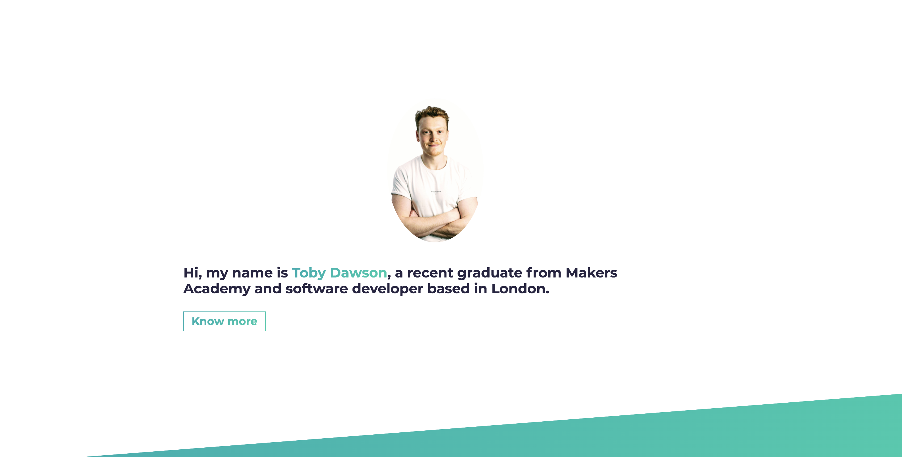
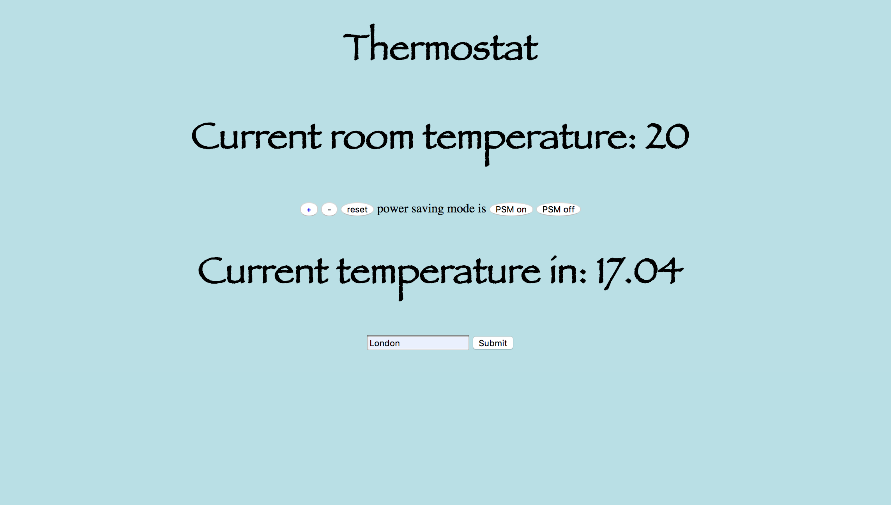

  
<h1> Toby Dawson </h1>
  <a href=https://www.linkedin.com/in/toby-dawson-942357158/>
   
      
   
  
   

[Projects](#projects) | [Skills](#skills) | [Education](#education) | [Experience](#experience) | [Hobbies and Interests](#hobbies-and-interests) |

I am a **Full Stack Developer** who has a passion for front-end engineering. I have helped build from the ground up a web application for Nandos UK and IE as well as maintaining it from September 2020 to January 2024. In the 3 months after that I was tasked with upgrading their restaurant portal from a create-next-app built in 2018 to Next 14 and React 18. This was a brilliant challenge that allowed me to consolidate and show off all of the skills I learnt over my first 3 and a half years in tech. Since then I have been helping the learning and careers team expand their website and intergrate a third party LMS for our staff in the restaurants to use.

Since graduating from Oxford Brookes University with a degree in City and Regional Planning I have worked in Switzerland in a highly demanding Hotel as a host and followed that up into a supervisor role for a 100 cover restaurant in Vauxhall. I decided Makers was the best place to start my journey after high recommendations from friends and the commitment Makers make towards teaching good practices and ensuring you focus is not just on your code but also on yourself as well as on the people around you for greater success for everyone.

**Tech Skills** : Typescript, Next.js, React, Sass, Playwight, HTML, GIT, Agile, Cypress, Jest, Node.js, HTML, CSS, Ruby, JavaScript, jQuery, Bootstrap, PostgreSQL

## Projects

For a complete list, see my [GitHub](https://github.com/tobydawson1?tab=repositories).

| Project   | Description | Technologies |
|---        |---         |---           |
| [mnemonic](https://github.com/tobydawson1/mnemonic)  <a href="https://github.com/tobydawson1/mnemonic">

</a>| A memory game, players are presented with 14 cards face up, these are quickly flipped to be hidden and you must find the cards that match by flipping them back over. | React, JavaScript, Jest, Enzyme, CSS |
| [Toby Dawson Portfolio](https://tobydawson.netlify.app/)  <a href="https://tobydawson.netlify.app/">

</a>| My personal website showcasing my all my projects and combining the skills I have learnt across my career. | React, JavaScript, CSS |
| [MakersBnB](https://github.com/tobydawson1/MakersBNB)   <a href="https://github.com/tobydawson1/MakersBNB">

</a> | An AirBnB clone for our first group project. | Ruby,  Sinatra, SQL  |
| [Thermostat](https://github.com/tobydawson1/Thermostat-)   <a href="https://github.com/tobydawson1/Thermostat-">

</a> | My first Javascript project, incorporating the jQuery library for a simple javascript web app. | Javascript, Jquery, Jasmine, HTML |
|[Bank Tech Test](https://github.com/tobydawson1/Bank-Tech-Test)| A tech test we were tasked with to prepare us for future tests | Ruby, RSPEC|
| [Makers Portfolio](https://github.com/tobydawson1/Makers_Portfolio) | All my work across the 12 weeks Makers course | |

## Skills

#### Emotional Intelligence 

I believe I have a strong ability to empathise with people and understand when they need space or when they need a helping hand. This is particularly key when working in software as sometimes people want the time to work through issues by themselves in order to grow and other times collaboration is what they really want. Occasionally that may just be sitting in and being present and othertimes it is taking the front foot and leading them to a solution. 

#### Confidence and Composure

Working in a highly stressful and fast paced industry like hospitality really showed me how key staying calm and presenting yourself with confidence is when you are working in a team or when dealing with clients. Sometimes you really don't want to be engaged with a client and just want to do your job but if you were to let your composure slip it becomes apparent so quickly that you don't want to be and you have to show confidence in your ability to do your job in order to portray an ideal image of a host and keep your client happy, content and cared for so they will come back.

#### Fast Learner and flexible

I have always been able to adapt to new situations and scenario's quickly, when you are working in Hospitality a lot can change very quickly. High turnover of your team, constant changing menu's, drinks, ingredients, methods. At No14 we had a week to learn everything about the hotel before our first guests arrived, being able to take in, process and apply knowledge gained in a short amount of time was something I prided myself on and Makers has only reinforced that pride. 

#### Team Player 

Working within a team is part and parcel of most professional work places and this was certainly the case for my previous roles. In my logistics role I worked in a team of 7 and we often had to organise 3 different vehicles travelling to up to 9 campus's across 3 city's all rotating in and out of one storage facility. Organisation and communication had to happen every day otherwise we simply would not of met our deadlines. 

#### Enthusiastic 

Positivity and enthusiasm is something that lightens up the whole room, my work has lead me to working 12/15 hour shifts often late into the night with increasingly drunk individuals. If you let your head drop not only do your fellow staff members feel it but your work also suffers which in my case my work were my clients.

## Additional Skills

#### Creative 

For the duration of my time at Makers I ran a blog on Instagram. I chose Instagram as I believe it to be a great way to artistically express yourself, it offered a way to show off my code and journey through Makers as well as my growth as a coder for the rest of my life hopefully. I was able to combine my love of sharing photos with my ability to formulate my thoughts in a creative and fun way but most importantly to show my passion for coding. I tried to make 3/4 posts a week with them varying between talking about my code, what I had learnt that week, teamwork and how to stay in a good mindset through tough problems. 

#### Rubix Cube

When I was 15 I memorised the eight algorithms needed in order to solve the cube. At 26 this skill has changed from a memory game to a muscle memory skill, its fascinating picking it up now and just working my way through it with no actual thought on what I am doing especially after sometimes three years of not touching one.

## Experience

#### Nandos UK and IE (Sept '20 - Present)

- Helped build their online ordering website from the ground up
- Helped maintain and add features to this site to improve the UX for our customers across 3 and a half years
- Upgraded their restaurant portal from a create-react-app to next 14 and react 18

#### gets.chomp (Jan '20 - May '20) 

- Blog editor and founder
- Tracked my learning across the four month Makers course 

#### Brunswick House(London) (May '19 to Dec '19)    

- Supervisor Role
- Dealt with cashing up, leading the service, opening and locking the building, general day to day management 

#### N.14(Switzerland) (Dec '18 to May '19)  

- Host Role
- Required undivided attention, commitment and standards for 5 months

#### Oxford Royale Academy(Oxford) (May '17 to Sep '17)

- Logistics Role 
- Needed self-motivation to get jobs done as we were not heavily managed, we were very much left to figure problems out ourselves*

#### DMC Solicitors (Summer 2010)

- Internship
- Answered the phone’s, faxing/photocopied documents and greeted clients.

  ## Education

#### Makers Academy (Dec 19 to april 20)

- OOP, TDD, MVC, DDD
- Agile/XP
- Ruby, Rails, JavaScript
- RSpec, Jasmine

#### Oxford Brookes University (Sept '13 to May '17)

- BA City and Regional Planning
- Played for University Hockey Team

#### Bryanston School (Sept '07 to June '12)

- A levels in Biology, Sports Science, Business and Economics
- 9 GCSE's
- Captained 2nd team in Tennis

## Hobbies and Interests

- **Cooking** : Give me a few ingredients and I will take them far. 
- **Sports** : Skiing, Football, Hockey, Sailing and going to the gym. 
- **Board Games** : Every Sunday some friends and I play a game or two.
- **Yoga** : Something I picked up at Makers, love that its a more laid back style of exercsising
